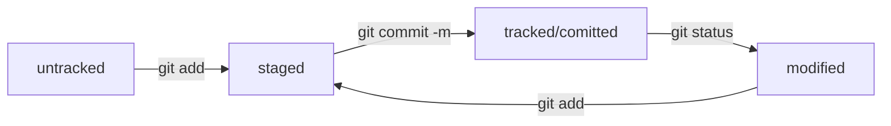

# Шпаргалка по работе с GIT

1. Скачать GIT
2. Создать репозиторий через команду **mkdir**
3. Инициализировать репозитоорий через команду **git init**
4. Зарегистироваться на GitHub
5. Создать новый репозиторий на GitHub
6. Создать SSH-ключ
7. Связать локальный и удаленный репозитории через команду **git remote add**
8. Синхронизировать изменения между репозиториями через команду **git push**

## Главные понятия:

Основные элементы описания коммита (команда **git log**):
* строка из цифр и латинских букв после слова **commit** — это хеш коммита;
* **Author** — имя автора и его электронная почта;
* **Date** — дата и время создания коммита;
* в конце находится сообщение коммита.

Git преобразует информацию о коммитах с помощью алгоритма SHA-1 и для каждого из них рассчитывает уникальный идентификатор — хеш.  
Хеш — основной идентификатор коммита и позволяет узнать его автора, дату и содержимое закоммиченных файлов.  

Можно вызвать не только полный лог (**git log**), но и сокращённый — это делается командой **git log --oneline**.  
В сокращённом логе выводятся сокращённые хеши — их можно использовать точно так же, как и полные.  

Файл **HEAD** — один из служебных файлов папки **.git**. Он указывает на коммит, который сделан последним (то есть на самый новый).

Статусы файлов (команда **git status**):
* **untracked** - файл, о существовании которого Git знает, но не следит за изменениями в нём.
* **tracked** - все файлы, отслеживаемые Git (противоположность **untracked**).
* **staged** - файл после выполнения команды **git add** (попадает в **staging area**).
* **modified** - файл был изменён.

Большинство файлов в проектах «шагает» по следующему циклу: «изменён» → «добавлен в список на коммит» → «закоммичен» → «изменён» → и так далее.

Правильное оформление сообщений к коммитам:
* сообщение коммита легко читается (кратко, емко и понятно);
* оно информативное (указано "где" и "что" сделано);
* все сообщения оформлены в одном стиле (номер задачи, если есть + инфинитив).

## Основные команды:

* __cd__ - переход по папкам и директориям
* __ls__ - посмотреть все файлы и папки в текущей папке
* __touch__ - создание файла в текущей папке
* __cp__ - копирование
* __mv__ - перемещение
* __cat__ - чтение
* __rm__ - удаление файла
* __rmdir__ - удаление папки
* __git status__ - текущее состояние проекта: есть ли незакоммиченные (изменённые) файлы и название текущей ветки
* __git add__ - подготовка файлов к сохранению
* __git commit -m__ - сохранение изменений в файлах (**самая важная команда**)
* __git log__ - история коммитов + хеши
* __git log --oneline__ - сокращённый лог + сокращённые хеши